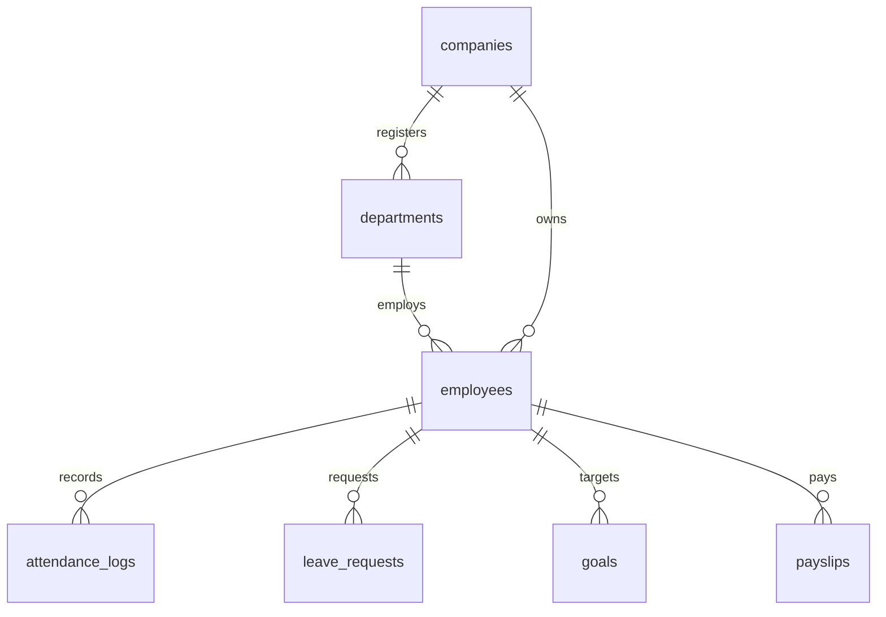

# 🚀 Enterprise HRMS

### AI-Powered Human Resource Management System

Modern Enterprise HRMS built with **Next.js 15, TypeScript, TailwindCSS, and Supabase** for the **Odoo Hackathon**.


> *Note: Placeholders in `docs/screenshots/` and `docs/images/` should be replaced with actual application screenshots.*

---

## 🛡️ Project Badges

[](https://nextjs.org/)
[](https://react.dev/)
[](https://www.typescriptlang.org/)
[](https://tailwindcss.com/)
[](https://supabase.com/)
[](https://www.postgresql.org/)
[](https://odoo.com/)
[](LICENSE)

---

## 📝 Project Description

**Enterprise HRMS** is an AI-ready Human Resource Management System developed during the **Odoo Hackathon**. It simplifies HR operations, including:
- **Employee Management**
- **Attendance**
- **Payroll**
- **Recruitment**
- **Leave Requests**
- **Performance Evaluation**
- **Training**
- **Asset Assignment**
- **Analytics & Custom Reports**

The application supports two distinct portals:
- **HR Admin Portal**: For managers, administrators, and executives to review organization structure, approve requests, analyze performance scoring, manage assets, and monitor payroll.
- **Employee Portal**: For staff members to request leaves, view schedules, track tasks, clock in/out, review salary components, and submit documents.

Both portals are connected in real-time through a centralized Supabase PostgreSQL database.

---

## 📸 Live Screenshots

Here are visual walkthroughs of the HRMS layout:

### 🏠 Landing Page


### 📊 Admin Dashboard


### 👤 Employee Dashboard


### 🔑 Authentication Flow


<details>
<summary>📂 Click to view screenshots of specific modules</summary>

#### 📅 Attendance


#### 📝 Leave Request


#### 💳 Payroll & Payslips


#### 🏢 Organization


#### 🎯 Performance & Reviews


#### 🚀 Calendar View


#### ⚙️ Settings


</details>

---

## ⚡ Feature Matrix

| Module | HR Admin Portal | Employee Portal | Central Database Sync |
| :--- | :--- | :--- | :--- |
| **Authentication** | Fixed credentials bypass (`admin` / `admin@123`) | Supabase Auth (`email/password` signup/login) | Yes (`profiles` + `auth.users`) |
| **Attendance** | Real-time active headcount monitoring | Today's clock-in history, work timers | Yes (`attendance_logs`) |
| **Leaves** | Pending approvals request manager | Balances tracker, submission form | Yes (`leave_requests` + `leave_balances`) |
| **Payroll** | Payroll cycles, wage configs, payout runs | Paycheck summary, earnings charts | Yes (`payslips` + `employee_salary`) |
| **Recruitment** | Active listings manager, candidate reviews | Openings feed, app status | Yes (`job_postings` + `candidates`) |
| **Performance** | Performance cycle launcher, evaluation ledger | Target goals tracker, self-assessment | Yes (`goals` + `performance_reviews`) |
| **Training** | Assign courses, monitor completion rate | Courses list, certificate progress | Yes |
| **Assets** | Asset register, assignments tracker | Assigned assets ledger | Yes (`assets` + `asset_assignments`) |
| **Settings** | Corporate theme toggle, security keys config | Contact edits, dark-mode toggle | Yes |

---

## 🛠️ Technology Stack

| Layer | Technology | Purpose |
| :--- | :--- | :--- |
| **Frontend Framework** | **Next.js 15 (App Router)** | Rendering, dynamic API routing, middleware guards |
| **UI Components** | **React 19 & Lucide Icons** | Component composition & icons |
| **Styling** | **Tailwind CSS 4.0** | Utility-first custom branding & responsive sheets |
| **Database Backend** | **Supabase (PostgreSQL)** | Persistent storage, real-time client sockets |
| **State Management** | **Zustand & React Context** | Light, reactive local UI states |
| **Charts** | **Recharts** | KPI area, line, bar, and donut visualizations |
| **Deployment** | **Vercel** | Edge network hosting & serverless executions |

---

## 📂 Folder Structure

```text
enterprise-hrms/
├── app/                        # Next.js App Router (pages & API paths)
│   ├── (admin)/                # Admin portal route group
│   ├── (employee)/             # Employee portal route group
│   ├── (auth)/                 # Login, signup, password resets
│   └── api/                    # Serverless API routes (health, employees)
├── components/                 # Reusable UI elements (cards, headers, layouts)
├── src/                        # Main application source logic
│   ├── config/                 # Supabase configs, environment validations
│   ├── context/                # AuthContext, dynamic session providers
│   ├── lib/                    # Supabase SSR middleware, utilities
│   └── store/                  # Zustand stores (UI configs, light/dark theme)
├── public/                     # Static media assets, icons, backgrounds
└── docs/                       # Project documentation & screenshots
```

---

## 🏗️ System Architecture

### Application & Routing Flow

```mermaid
graph TD
    Landing[Landing Page /] -->|Continue as Admin| LoginAdmin[/login/admin]
    Landing -->|Continue as Employee| LoginEmp[/login/employee]
    Landing -->|Sign Up| SignUpEmp[/signup/employee]
    
    LoginAdmin -->|Hardcoded Credentials| DashboardAdmin[/admin/dashboard]
    LoginEmp -->|Supabase Auth| DashboardEmp[/employee/dashboard]
    SignUpEmp -->|Register User & Profile| LoginEmp
    
    subgraph Route Guard Middleware
        DashboardAdmin -.->|Requires Admin Cookie| AuthCheck{Authorized?}
        DashboardEmp -.->|Requires Supabase Session| AuthCheck
    end
```

### Database Entity-Relationship Diagram



---

## ⚙️ Installation & Setup

1. **Clone the repository**:
   ```bash
   git clone https://github.com/sivasubramaniyan-06/Odoo-NMIT-Hackathon-CYGUIN.git
   cd Odoo-NMIT-Hackathon-CYGUIN
   ```

2. **Install dependencies**:
   ```bash
   npm install
   ```

3. **Configure Environment Variables**:
   Create a `.env` file in the root directory:
   ```env
   NEXT_PUBLIC_SUPABASE_URL=https://your-project.supabase.co
   NEXT_PUBLIC_SUPABASE_ANON_KEY=your-anon-key
   ```

4. **Start the local development server**:
   ```bash
   npm run dev
   ```

5. **Build for Production**:
   ```bash
   npm run build
   npm run start
   ```

---

## 🔄 Project Workflows

### 1. Leave Approval Workflow
```text
Employee applies leave -> DB Table Updates -> Admin Receives Live Approval Card -> Admin Approves -> Leave Request status becomes Approved -> Employee dashboard updates instantly
```

### 2. Time Clock Workflow
```text
Employee clocks in -> Attendance log inserts -> Admin active panel registers clock-in -> KPI dashboard attendance percentage increments immediately
```

---

## 🗺️ Future Roadmap

- [ ] **AI Resume Screening**: Parse candidate PDFs and rank them using NLP scores.
- [ ] **AI Attendance Prediction**: Detect attrition risks based on attendance trends.
- [ ] **Voice Assistant**: Allow hands-free schedule management for workers.
- [ ] **Biometric & QR Attendance**: Integrate physical hardware logs with the cloud databases.
- [ ] **Document OCR**: Automatically extract expense dates and costs from receipt scans.

---

## 👥 Development Team

| Name | Role | Profile |
| :--- | :--- | :--- |
| **Siva Subramaniyan** | Team Lead / Full Stack Developer | [GitHub Profile](https://github.com/sivasubramaniyan-06) |
| **Deepa** | Frontend Developer | Contributor |
| **Dharshini** | Frontend Developer | Contributor |

---

## 🏆 Hackathon Information
Developed for the **🏆 Odoo Hackathon** focusing on HR automation, cloud databases, dashboard analytics, and clean scalable architecture.

---

## 📄 License
This project is licensed under the MIT License - see the [LICENSE](LICENSE) file for details.

---

⭐ **If you like this project, please give it a Star on GitHub!**

*Made with ❤️ by Team Enterprise HRMS.*
